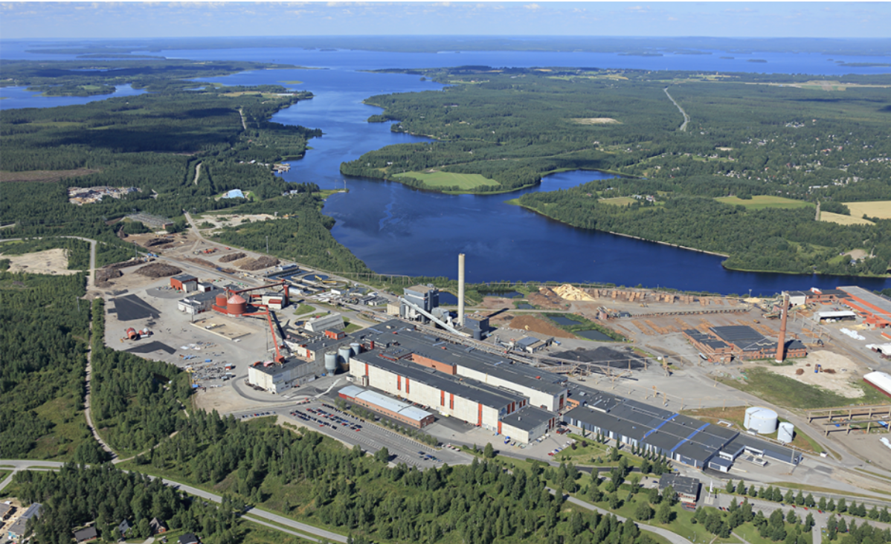

--- 
title: Point cloud workshop
subtitle: online
author: Samantha Wittke and Kylli Ek
date: 08.02.22
lang: en
---


# Practicalities

* let's focus on discussions
* no recording
* shared notes and Q&A on HackMD
* breakoutrooms are available

---

# HackMD

<br></br>
[`hackmd.io/@GeospatialCSC/pointcloud_workshop`](https://hackmd.io/@GeospatialCSC/pointcloud_workshop)
<br></br>

---

# Today

* Short intro to CSC resources
* Use cases of point cloud research using CSC resources
* Discussion time

---

# CSC 

<div class="column">
* non-profit state enterprise with special tasks
* owned by Finnish state (70%) and higher education institutions (30%)
* headquaters in Keilaniemi, Espoo
* side offices and supercomputers in Kajaani
</div>

<div class="column">

   

</div>
---

# CSC services

[`research.csc.fi/en/service-catalog`](https://research.csc.fi/en/service-catalog)

<br></br>
<div class="column">
**Compute & Analyze**

  - cPouta / ePouta
  - Puhti / Mahti / LUMI
  - Notebooks
</div>
<div class="column">
**Store, Share & Publish Data**

  * Allas
  * EUDAT
  * IDA
  * Paituli
</div>

---

# Why use CSC resources?

When own computer is not enough:

* Resource needs (time (> 2 hours), memory (> 8 GB), storage (> 50GB))
**-> Outsource computations, keep own computer free**


* **Server** needs -> cPouta
* **Course computers** (same setup) -> Notebooks
* It’s **free**! (for open science at Finnish university and state research institute users)

---

# CSC expertise

<div class="column">
...at your fingertips:

[`docs.csc.fi`](https://docs.csc.fi)

[`research.csc.fi`](https://research.csc.fi)

</div>
<div class="column">
**\+ servicedesk@csc.fi**
<br></br>

* Geoinformatics team
* Storage team
* Supercomputer team
* Cloudcomputing team
* Accounts team
* ...
</div>

---

# CSC projects

* necessary for doing anything
* needs 'PI'
* PI applies for CSC project with
    * Billing units
    * services
  
Project members share resources, storage and computing storage

---

# Billing Units (BU)

* per project
* resources (CPU / GPU amount and time) on supercomputer
* Virtual Machine uptime
* Allas storage amount and time

---

# my.csc.fi

<br></br>
[`my.csc.fi`](https://my.csc.fi)
<br></br>

---

# Point clouds

`set of data points in 3D space`

**Sources:**

* spaceborne / airborne / terrestrial / mobile LiDAR
* photogrammetry (from images: structure from motion / multi view stereo ...)

**File formats:**

* ASCII: XYZ, ASC,  PTX,  ...
* binary: LAS/LAZ , FLS, PCD,  ...
* other: PLY, FBX, E57 , OBJ, ...

---

# Software and data

<br></br>
[`hackmd.io/@GeospatialCSC/pointcloud_workshop`](https://hackmd.io/@GeospatialCSC/pointcloud_workshop)
<br></br>

---

# Storage and sharing solutions 

<br></br>
[`research.csc.fi/storage`](https://research.csc.fi/storage)
<br></br>
[`paituli.csc.fi/`](https://paituli.csc.fi/)
<br></br>

---

# Computing solutions - Puhti

<p align="center">
   
</p>

---

# Puhti webinterface demo

<br></br>
[`puhti.csc.fi`](https://puhti.csc.fi)
<br></br>


---


# Example batch job script:

```bash

#!/bin/bash 
#SBATCH --job-name=myTest 
#SBATCH --account=<project> 
#SBATCH --time=02:00:00
#SBATCH --cpus-per-task=4 
#SBATCH --mem-per-cpu=2000 
#SBATCH --partition=small
 
module load geoconda

srun python my_python_script.py input output

```

---

# Computing resources for you*

<p align="center">
   
</p>

---

# Getting started

* [Step by step instructions ](https://research.csc.fi/en/accounts-and-projects)
* [Find your account and project information](my.csc.fi)

* [Read the docs](https://docs.csc.fi)

* check our [tutorials](https://docs.csc.fi/support/tutorials/) and [geocomputing examples](https://github.com/csc-training/geocomputing)

---  

# Training

* ['Using CSC environment efficiently' course](https://csc-training.github.io/csc-env-eff/)
* -> also as [interactive course 23.-25.3](https://ssl.eventilla.com/enveff2022?)
* [Python GIS course 7-10.3](https://ssl.eventilla.com/event/pENQa?)

-> follow our [training calendar](https://www.csc.fi/en/training#training-calendar)

---

# How we can help

<div class="column">
* 'Z is not working as expected'
* 'my code gives error Y '
* 'can A be installed to Puhti?'
* 'any advice how to do X?'
* training/example wishes

**-> servicedesk@csc.fi**

[Speed up your request](https://docs.csc.fi/support/support-howto/)

</div>
<div class="column">
* Setting up pipelines, product provision, R&D, ...

**-> CSC as project partner / subcontractor**
</div>


---

# Geoinformatics team { .author }

| Kylli Ek
| Samantha Wittke
| CSC – IT Center for Science Ltd.

giscoord@csc.fi


